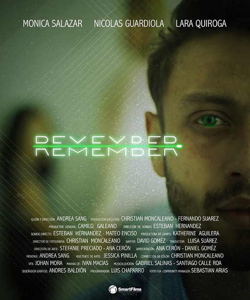

# Remember
This is an application developed for the short film that bears the same name. The characters use it to live happy past moments :hourglass:

## About the short film
Remember was released in [SmartFilms](https://smartfilms.com.co/) on September 8, 2019 :movie_camera:. The short film was recorded only with smartphones :iphone:. "*Aficionado Motorola*" was the category in which the team participated with the short film.

## About the app
### Technologies
* Developed with Android Studio IDE 3.4.1
* Written with Java Language
* Android version: 4.4.4 - 10.0

### Features
* Awesome UI Design, made by Andrés Baldión.
* Great Responsive Design (RD), implemented on all pages.

### Usage
Just download the files, install the app with Android Studio and enjoy it :smiley:
